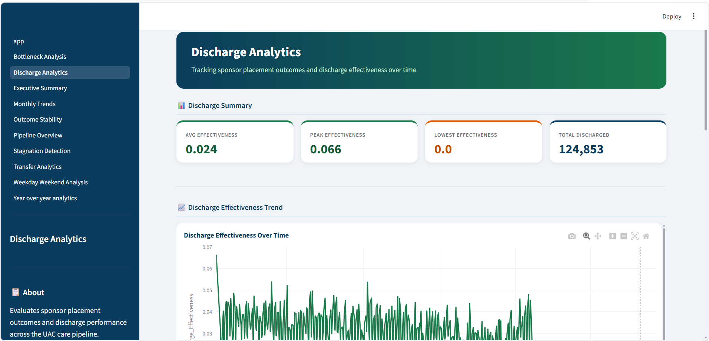

# Care Transition Efficiency & Placement Outcome Analytics

[](https://care-transition-efficiency-placement-outcome-analytics-mxvpwqq.streamlit.app/)

## Overview

Care Transition Efficiency & Placement Outcome Analytics is an interactive Streamlit dashboard developed to analyze the operational performance of the U.S. Unaccompanied Alien Children (UAC) care pipeline. The project transforms raw operational data into actionable KPIs, visual analytics, and statistical insights to support data-driven decision making.

---

## Live Dashboard

**Streamlit App:**  https://care-transition-efficiency-placement-outcome-analytics-mxvpwqq.streamlit.app/

---

## GitHub Repository

**GitHub Project Link:** https://github.com/Sandhya-Rani-Dash/Care-Transition-Efficiency-Placement-Outcome-Analytics

---

## Objectives

- Monitor transfer efficiency across the care pipeline.
- Evaluate discharge effectiveness over time.
- Detect operational bottlenecks and stagnation periods.
- Compare yearly operational performance.
- Generate evidence-based recommendations for policymakers.

---

# Dashboard Modules
______________________________________________________________________________
|         Module           |                  Description                    |
|__________________________|_________________________________________________|
| Executive Summary        | High-level KPI overview and recommendations     |
| Care Pipeline Overview   | Sankey Diagram and throughput analysis          |
| Transfer Analytics       | Transfer efficiency trends and monthly analysis |
| Discharge Analytics      | Discharge effectiveness analysis                |
| Bottleneck Analysis      | Transfer backlog detection                      |
| Stagnation Detection     | Alert generation and stagnation periods         |
| Outcome Stability        | Rolling performance analysis                    |
| Monthly Trends           | Seasonal trend analysis                         |
| Weekday vs Weekend       | Operational comparison                          |
| Year-over-Year Analytics | Annual KPI comparison                           |
|__________________________|_________________________________________________|

---

# Key Performance Indicators

- Transfer Efficiency
- Discharge Effectiveness
- Pipeline Throughput
- Average Daily Backlog
- Average HHS Population
- Total Discharged

---

# Technologies Used

- Python
- Streamlit
- Pandas
- NumPy
- Plotly
- Pathlib
- Statsmodels
- Git
- GitHub

---

# Dashboard Preview

## App Page


---

## Executive Summary


---

## Care Pipeline Overview


---

## Transfer Analytics


---

## Discharge Analytics



---

## Bottleneck Analysis


---

## Stagnation Detection


---

## Year-over-Year Analysis


---

# Research Paper

The repository also includes a complete research paper containing:

- Exploratory Data Analysis
- KPI Development
- Statistical Evaluation
- Dashboard Design
- Discussion
- Recommendations
- Executive Summary for Government Stakeholders

---

# Installation

Clone the repository

```bash
git clone https://github.com/Sandhya-Rani-Dash/Care-Transition-Efficiency-Placement-Outcome-Analytics.git
```

Install dependencies

```bash
pip install -r requirements.txt
```

Run

```bash
streamlit run dashboards/app.py
```

---

# Contact

**Sandhya Rani Dash**

**GitHub:** https://github.com/Sandhya-Rani-Dash